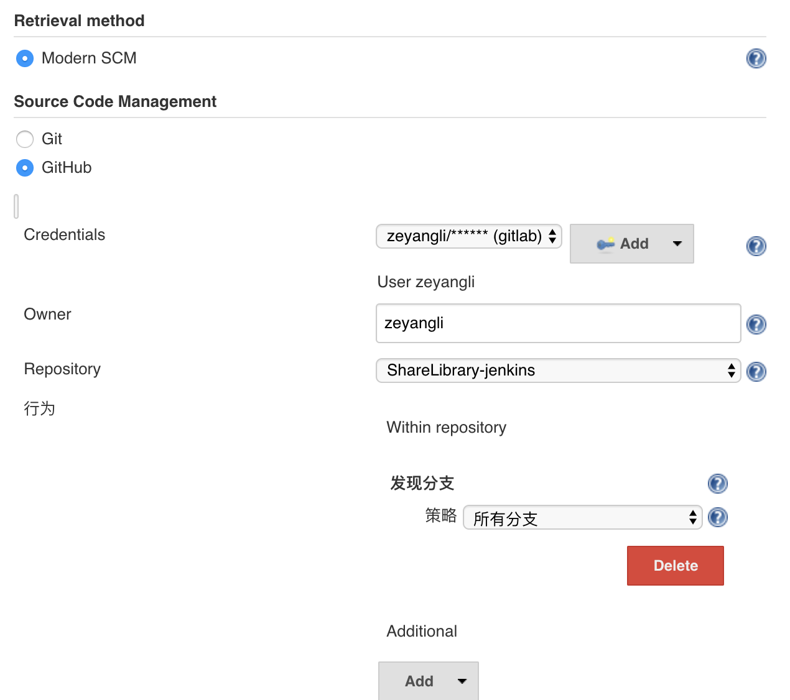

{}
您好，本模块主要学习Jenkins共享库的配置，目的是能够让大家编写更加灵活强大的流水线😀
{}

### 目录

+ [概述](#概述)
+ [共享库内容](#共享库内容)
+ [创建共享库](#创建共享库)
+ [使用共享库](#使用共享库)

---


### 概述

共享库这并不是一个全新的概念，其实具有编程能力的同学应该清楚一些。例如在编程语言Python中，我们可以将Python代码写到一个文件中，当代码数量增加，我们可以将代码打包成模块然后再以import的方式使用此模块中的方法。

在Jenkins中使用Groovy语法，共享库中存储的每个文件都是一个groovy的类，每个文件（类）中包含一个或多个方法。每个方法包含groovy语句块。

我把共享库代码上传到了github，大家可以参考[demo共享库](https://github.com/zeyangli/jenkinslib)

### 共享库内容

这是一个demo演示的共享库，大家可以看到仓库的结构与内容。这个仓库中包含了很多类，例如：我将kubernetes中的API方法封装在了kubernetes.groovy文件中，便于后面引用。**在此你只需要知道共享库的结构
，具体该如何创建共享库后面会讲述😀**


```
── docs
│   └── README.mdREADME.md
├── src
│   └── org
│       └── devops
│           └── tools.groovy
└── vars
```

src目录主要存放我们要编写的groovy类，执行流水线时，此目录将添加到class_path中。
vars目录主要存放脚本文件，这些脚本文件在流水线中作为变量公开。
resources目录允许从外部库中使用步骤来加载相关联的非Groovy文件。


### 创建共享库

新建文件`src/org/devops/tools.groovy`, 在此我将这个文件定义为扩展工具类，主要放一些扩展方法。

例如：在构建日志中查看流水线详细日志会很乱，我们可以在日志中将重点步骤通过不同的颜色高亮显示，便于排错。 我们开始写这样的一个方法`PrintMes()`,包含两个参数，输出内容`value`和内容的颜色`color`。


{}
注意： 我们需要安装 插件`AnsiColor`，这样才能使用ansiColor()方法，可以在`片段生成器`查看更多的用法。
{}

```
package org.devops

//格式化输出
def PrintMes(value,color){
    colors = ['red'   : "\033[40;31m >>>>>>>>>>>${value}<<<<<<<<<<< \033[0m",
              'blue'  : "\033[47;34m ${value} \033[0m",
              'green' : ">>>>>>>>>>${value}>>>>>>>>>>",
              'green1' : "\033[40;32m >>>>>>>>>>>${value}<<<<<<<<<<< \033[0m" ]
    ansiColor('xterm') {
        println(colors[color])
    }
}
```

### 使用共享库

我们导航到 系统配置 ->  `Global Pipeline Libraries`

首先，我们为共享库设置一个名称`jenkinslib`，注意这个名称后续在Jenkinsfile中引用。 再设置一个默认的版本，这里的版本是分支的名称。我默认配置的是`master`版本。


接下来我们配置共享库的仓库地址，我的仓库在github中，所以这里我填写的是github的方式。（如果你用的是gitlab可以使用gitlab方式或者git方式）。如果仓库是私有的方式，需要在jenkins的凭据中添加一个账号用于下载共享库。



好，到此共享库在Jenkins的配置就完成了，接下来测试在Jenkinsfile中引用。

在Jenkinsfile中使用`@Library('jenkinslib') _ `来加载共享库，注意后面符号`_`用于加载。 
类的实例化`def tools = new org.devops.tools()`,使用类中的方法`tools.PrintMes("获取代码",'green')`。


```Jenkinsfile
#!groovy

@Library('jenkinslib') _     

def tools = new org.devops.tools()


pipeline {
    agent { node {  label "master" }}

    stages {
        //下载代码
        stage("GetCode"){ 
            steps{  
                timeout(time:5, unit:"MINUTES"){   
                    script{ 
                        tools.PrintMes("获取代码",'green')
                    }
                }
            }
        }
    }
}

```


接下来在你的Jenkins上面运行一下吧，测试一下是否能够看到带有绿色的文字呢？
